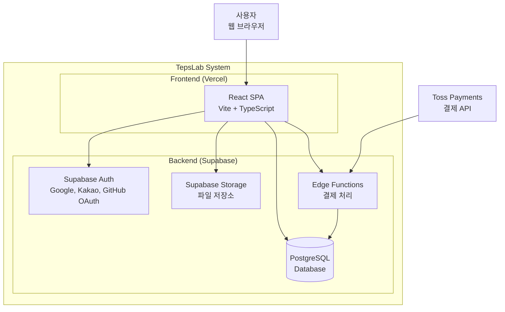

# TepsLab 시스템 아키텍처 (C4 Container Diagram)

## 개요
TepsLab은 Frontend + Supabase Direct 아키텍처를 사용합니다.
별도의 백엔드 서버 없이 Supabase를 직접 호출하여 운영 복잡도를 최소화합니다.

## Container Diagram



## 컴포넌트 설명

| 컨테이너 | 기술 | 역할 |
|---------|------|------|
| **React SPA** | React 19, Vite 7, TypeScript | 사용자 인터페이스, PWA |
| **Supabase Auth** | Supabase Auth | 인증/인가 (OAuth) |
| **PostgreSQL** | Supabase PostgreSQL | 데이터 저장, RLS 적용 |
| **Storage** | Supabase Storage | 이미지, 파일 저장 |
| **Edge Functions** | Deno Runtime | 결제 처리, 웹훅 |

## 데이터 흐름

### 인증 흐름
```
사용자 → React → Supabase Auth → JWT 발급 → React (저장)
```

### 데이터 조회 흐름
```
React → Supabase Client → PostgreSQL (RLS 적용) → 데이터 반환
```

### 결제 흐름
```
React → Toss Payments SDK → 결제 완료 → Edge Function → DB 저장
```

## 보안 고려사항

1. **Row Level Security (RLS)**: 모든 테이블에 RLS 정책 적용
2. **JWT 인증**: Supabase Auth를 통한 토큰 기반 인증
3. **HTTPS**: Vercel + Supabase 모두 HTTPS 강제
4. **환경 변수**: 민감한 키는 Vercel 환경 변수로 관리

## 배포 구조

```
┌─────────────────┐     ┌─────────────────┐
│     GitHub      │────▶│     Vercel      │
│   (소스 코드)    │     │   (프론트엔드)   │
└─────────────────┘     └─────────────────┘
                              │
                              ▼
                        ┌─────────────────┐
                        │    Supabase     │
                        │   (백엔드)       │
                        └─────────────────┘
```
